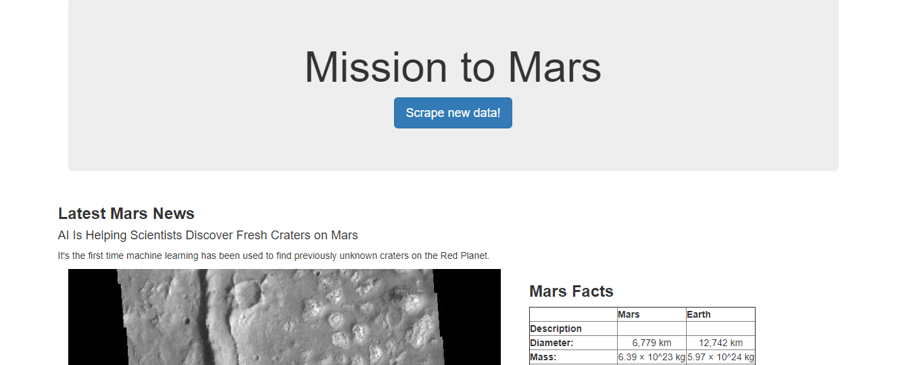
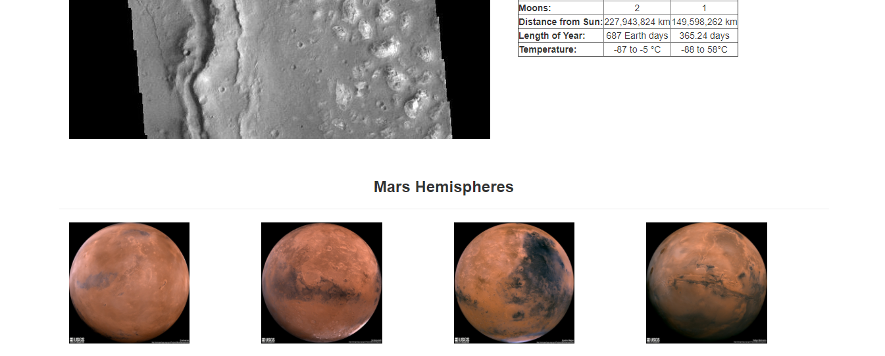

# Web Scraping

In this challenge, we demonstrated how web-scraping can be used to update a website with the click of a button. You can find the finished website [here](https://corters22.github.io/web-scraping-challenge/templates/index.html). Feel free to click on the 'Scrape New Data' button for more Mars information.

### Scraping
We start off with scraping  multiple websites for different information about Mars, the Red Planet. You can find the scraping code in jupyter notebook [here](Mission_to_Mars/mission_to_mars.ipynb) or in python [here](scrape_mars.py).

1. Mars News - The latest headline and teaser for the article

[https://redplanetscience.com/](https://redplanetscience.com/)

2. JPL Mars Space Images - featured image

[https://spaceimages-mars.com/](https://spaceimages-mars.com/)

3. Mars Facts - table comparing Mars and Earth

[https://galaxyfacts-mars.com/](https://galaxyfacts-mars.com/)

4. Mars Hemispheres - pictures of all four hemispheres

[https://marshemispheres.com/](https://marshemispheres.com/)

### MongoDB and Flask App
After scraping the websites, we then converted the [jupyter notebook](Mission_to_Mars/mission_to_mars.ipynb) to a [python script](scrape_mars.py) defining a function that does the web scraping automatically. This information is then inserted into a MongoDB database. Using the flask library in Python, we created [app routes](app.py) to run the scraping function and display it on a [website](templates/index.html). 

### Screenshots of Site

